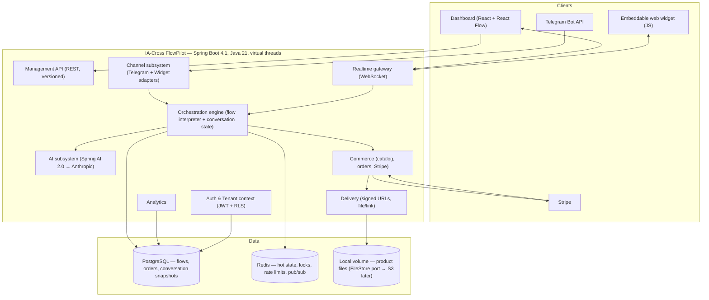

# FlowPilot — Architecture & Planning Docs

This directory holds the six planning documents and the main architecture reference.

| File | Contents |
|------|----------|
| `01-vision.md` | Product vision, goals, and non-goals |
| `02-architecture.md` | System architecture — modules, boundaries, ADRs |
| `03-data-model.md` | Entity model, schema decisions |
| `04-api-design.md` | REST / WebSocket surface, versioning strategy |
| `05-ai-integration.md` | AI module design, prompt strategy, model routing |
| `06-roadmap.md` | Milestone plan, phased delivery |

## Module Map

```
backend/src/main/java/com/iacross/flowpilot/
├── identity/    — auth, users, tenants, API keys
├── channel/     — channel adapters (web, WhatsApp, Slack, email …)
├── flow/        — conversation flow definitions & versioning
├── engine/      — runtime execution of flows
├── ai/          — LLM routing, prompt templates, RAG
├── commerce/    — billing, plans, usage metering
├── delivery/    — outbound message dispatch & retries
├── analytics/   — event collection, aggregation, reporting
└── shared/      — cross-cutting concerns (domain events, value objects)
```

# IA-Cross FlowPilot

**A self-hostable, multi-tenant platform for AI-assisted chat sales funnels.**
Connect a bot, draw a workflow, sell and deliver digital products automatically — all running on a single modest VPS.

> **Portfolio note.** This project is built to demonstrate high-concurrency backend engineering in Java 21 with Spring Boot 4.1 and Project Loom virtual threads. The central claim — that a Loom-based server sustains a large multiple of a fixed-thread-pool baseline at the same memory budget, without reactive complexity — is backed by a reproducible benchmark. See [the benchmark →](#benchmark-results).

---

## What it does

A business owner connects a **Telegram bot** or an **embeddable web chat widget**, then uses a drag-and-drop canvas to build a conversation flow — qualify the lead, answer questions with AI, collect payment, deliver the product, follow up. Every step is automatic.

```
Buyer messages bot
  → AI classifies intent (buy / question / unknown)
    → offer presented
      → Stripe checkout link
        → payment confirmed
          → product auto-delivered
            → follow-up window open
```

A live conversation view lets an operator watch active conversations, intervene, and hand control back to the bot.

---

## Why this architecture

Every conversation is mostly waiting: waiting on Telegram, on the AI provider, on Stripe, on the database. That is the canonical workload for **Java 21 virtual threads (Project Loom)** — thousands of conversations parked cheaply on a handful of carrier threads, written in plain blocking code, with no reactive plumbing required.

| | Platform threads (fixed pool) | Virtual threads (Loom) |
|---|---|---|
| Code style | Blocking or reactive | Blocking |
| Concurrency unit cost | ~1 MB / thread | ~few KB / virtual thread |
| Concurrent conversations on 4 GB VPS | limited by pool size | thousands |
| Stack traces | readable | readable |

The benchmark (below) measures this on real hardware rather than asserting it.

---

## Architecture



**Design decisions at a glance:**

| Decision | Choice | Why |
|---|---|---|
| Concurrency | Java 21 virtual threads | I/O-bound workload; blocking code, no reactive tax |
| Architecture | Modular monolith | Single VPS target; bounded internal modules |
| Channels | Telegram + web widget | Same engine core, two adapters (channel contract) |
| State | PostgreSQL (durable) + Redis (hot) | Resume after restart; low-latency stepping |
| Flow versioning | Immutable `flow_version` JSONB | In-flight conversations pin to their started version |
| Payments | Stripe (test mode) behind a provider port | Idempotent webhook handling; swappable |
| Storage | Local FS volume behind `FileStore` port | Cost-minimal MVP; S3/MinIO is a config swap |
| Secrets | AES-GCM, env-supplied key | Never in code or DB plaintext |
| Isolation | Tenant-scoped repositories + PostgreSQL RLS | Defense in depth; CI-verified |

---

## Stack

| Layer | Technology |
|---|---|
| Language | Java 21 LTS |
| Framework | Spring Boot 4.1 / Spring Framework 7 |
| AI | Spring AI 2.0 → Anthropic (claude-sonnet-4-6) |
| Frontend | React, React Flow, IBM Plex Sans |
| Database | PostgreSQL 16/17 (Flyway migrations) |
| Cache / state | Redis 7 |
| Payments | Stripe API (test mode) |
| Observability | Micrometer → Prometheus + Grafana |
| Tracing | OpenTelemetry |
| Build | Gradle (Kotlin DSL), Java 21 toolchain |
| Deploy | Docker Compose, single VPS (Hetzner CX / Oracle Free Tier ARM) |

---

## Repo structure

```
ia-cross-flowpilot/
├── backend/          # Spring Boot modular monolith
│   └── src/main/java/com/iacross/flowpilot/
│       ├── identity/     # tenants, auth, JWT
│       ├── channel/      # Telegram + widget adapters
│       ├── flow/         # flow graph, versioning
│       ├── engine/       # orchestration, node executors, state machine
│       ├── ai/           # Spring AI integration, intent classification
│       ├── commerce/     # catalog, orders, Stripe
│       ├── delivery/     # file/link delivery, signed URLs
│       ├── analytics/    # metrics, dashboard queries
│       └── shared/       # cross-cutting: money, UUIDv7, tenant context
├── dashboard/        # React SPA (flow builder + console)
├── widget/           # embeddable chat widget (isolated JS bundle)
├── infra/            # docker-compose.yml, Prometheus/Grafana configs
├── bench/            # k6/Gatling load harness + benchmark report
└── docs/             # planning document set (PRD → Implementation Plan)
```

---

## Quick start (local)

**Prerequisites:** JDK 21, Docker + Compose, Node.js LTS, a webhook tunnel (ngrok or cloudflared).

```bash
# 1. Clone
git clone https://github.com/isaac/<repo>.git
cd ia-cross-flowpilot

# 2. Configure — copy the example and fill in your values
cp .env.example .env
# Required: TELEGRAM_BOT_TOKEN, ANTHROPIC_API_KEY, STRIPE_TEST_SECRET_KEY,
#            STRIPE_WEBHOOK_SECRET, APP_ENCRYPTION_KEY (AES-GCM, 32-byte hex)
# None of these ever commit to the repo.

# 3. Start backing services
docker compose up -d postgres redis

# 4. Run the backend (migrations apply on startup)
cd backend && ./gradlew bootRun

# 5. Run the dashboard
cd dashboard && npm install && npm run dev

# 6. (Telegram) expose your local port via a tunnel
ngrok http 8080
# then set the webhook URL in .env and restart
```

The backend starts at `http://localhost:8080`, the dashboard at `http://localhost:5173`.

**One-command production-style bring-up** (all services including app):
```bash
docker compose up
```

---

## Running the tests

```bash
# Unit + integration (Testcontainers — Postgres and Redis spin up automatically)
cd backend && ./gradlew test

# Cross-tenant isolation test (verifies RLS backstop)
./gradlew test --tests "*TenantIsolation*"

# Channel-parity contract test (same flow, both channels)
./gradlew test --tests "*ChannelParity*"
```

---

## Benchmark results

> **Hypothesis:** virtual threads sustain a significantly higher number of concurrent I/O-bound conversations than a fixed platform-thread pool of comparable memory footprint, with no increase in per-request latency until the platform-thread pool saturates.

**Hardware:** single 2 vCPU / 4 GB VPS (Hetzner CX-class). **Toggled by config only** — same codebase, same load, two settings:

```properties
# Virtual threads (A)
spring.threads.virtual.enabled=true

# Platform threads (B — baseline)
spring.threads.virtual.enabled=false
server.tomcat.threads.max=200
```

| Metric | Platform threads (B) | Virtual threads (A) | Δ |
|---|---|---|---|
| Max sustained concurrent convs | — | — | — |
| p95 engine latency (ms) | — | — | — |
| Peak heap (MB) | — | — | — |
| Pinning events (JFR) | n/a | 0 | — |
| Error rate at peak | — | — | — |

*Results will be filled in during Phase 6 of the build. The harness lives in `bench/`; run it yourself with:*

```bash
cd bench && k6 run virtual_threads.js   # config A
cd bench && k6 run platform_threads.js  # config B
```

Grafana snapshots for both runs are committed in `bench/results/`.

---

## Observability

With `docker compose up`, Grafana is available at `http://localhost:3000` (admin/admin). Three dashboards:

- **Operator** — active conversations, message throughput, latency percentiles.
- **JVM / Concurrency** — heap, GC, mounted/parked virtual thread counts, carrier thread pool, pinning events.
- **Commerce** — order funnel, payment success rate, delivery status.

---

## Planning documents

The full design rationale lives in `docs/`. Start here if you want to understand *why* something was built the way it was.

| Document | What it covers |
|---|---|
| [PRD](docs/PRD-AI-Workflow-Chatbot-Orchestrator.md) | Goals, personas, functional requirements, non-goals |
| [TRD](docs/TRD-AI-Workflow-Chatbot-Orchestrator.md) | Architecture decisions (ADR-001 through ADR-008), component design, concurrency model |
| [Backend Schema](docs/Backend-Schema-AI-Workflow-Chatbot-Orchestrator.md) | PostgreSQL DDL, JSONB flow-graph spec, Redis key model, RLS policies, JPA guidance |
| [UI/UX](docs/UIUX-AI-Workflow-Chatbot-Orchestrator.md) | Design tokens, screen specs, flow builder detail, widget anatomy |
| [App Flow](docs/App-Flow-AI-Workflow-Chatbot-Orchestrator.md) | Dashboard navigation flows, conversation state machine, runtime conversation flows |
| [Implementation Plan](docs/Implementation-Plan-AI-Workflow-Chatbot-Orchestrator.md) | Phase breakdown, critical path, definition of done |

---

## Project status

| Phase | Focus | Status |
|---|---|---|
| P0 | Foundations & walking skeleton | 🔲 Not started |
| P1 | Orchestration engine + Telegram | 🔲 Not started |
| — | Benchmark smoke test | 🔲 Not started |
| P2 | AI intent + all node types | 🔲 Not started |
| P3 | Commerce + delivery | 🔲 Not started |
| P4 | Flow Builder + dashboard | 🔲 Not started |
| P5 | Widget + live conversations | 🔲 Not started |
| P6 | Benchmark (formal) | 🔲 Not started |
| P7 | Analytics, hardening, portfolio packaging | 🔲 Not started |

---

## Environment variables reference

All secrets are supplied at runtime. The repo ships `.env.example` with placeholder values only — **the real `.env` is gitignored and never committed**.

| Variable | Required | Description |
|---|---|---|
| `DB_URL` | ✅ | JDBC URL for PostgreSQL |
| `DB_USER` / `DB_PASSWORD` | ✅ | Database credentials |
| `REDIS_URL` | ✅ | Redis connection string |
| `JWT_SECRET` | ✅ | HS256 signing key (min 32 bytes) |
| `APP_ENCRYPTION_KEY` | ✅ | AES-GCM master key for secret columns (32-byte hex) |
| `TELEGRAM_BOT_TOKEN` | P1+ | From @BotFather |
| `TELEGRAM_WEBHOOK_SECRET` | P1+ | Secret token for webhook verification |
| `ANTHROPIC_API_KEY` | P2+ | Anthropic API key (set a spend cap) |
| `STRIPE_TEST_SECRET_KEY` | P3+ | Stripe test-mode secret key |
| `STRIPE_WEBHOOK_SECRET` | P3+ | Stripe webhook signing secret |
| `FILES_BASE_PATH` | ✅ | Local path for product file storage |

---

## License

MIT — see [LICENSE](LICENSE).

---

<p align="center">
  Built by <a href="https://github.com/isaac">Isaac</a> · Java 21 · Spring Boot 4.1 · Spring AI 2.0 · React
</p>